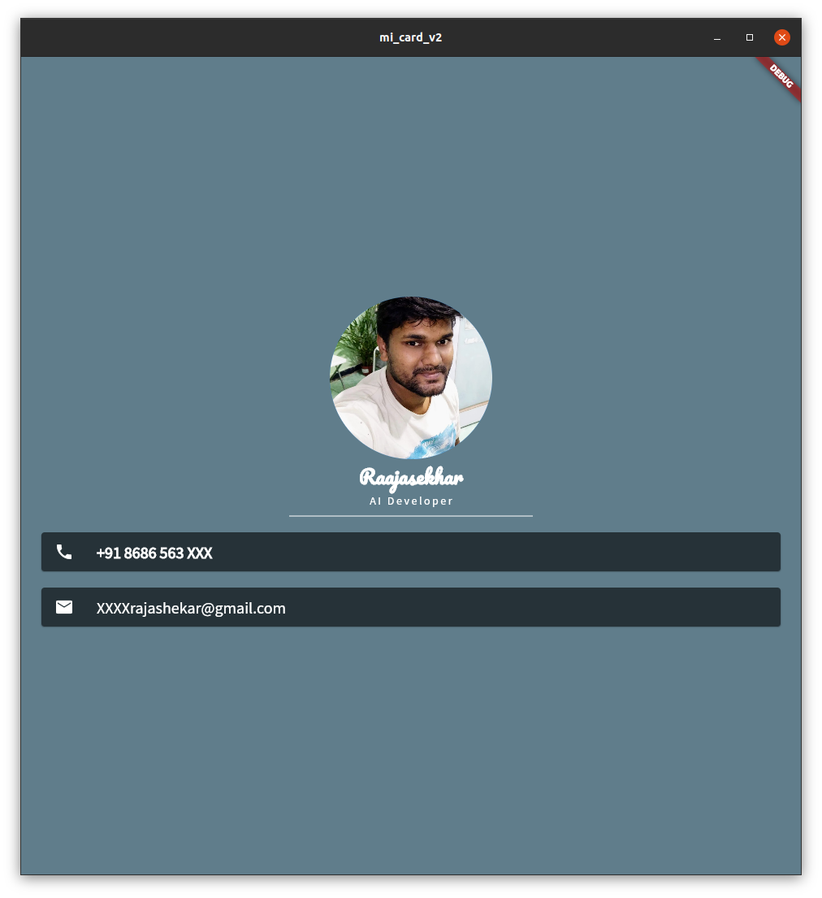

# mi_card_v2

# vCard
Visting card from android (or iOS) application, Learning Flutter framework

### As a part of that I have developed a stateless application  which works on Platforms like Windows,Linux,Mac,Android,IOS.
However it does nothing other than looking like this

